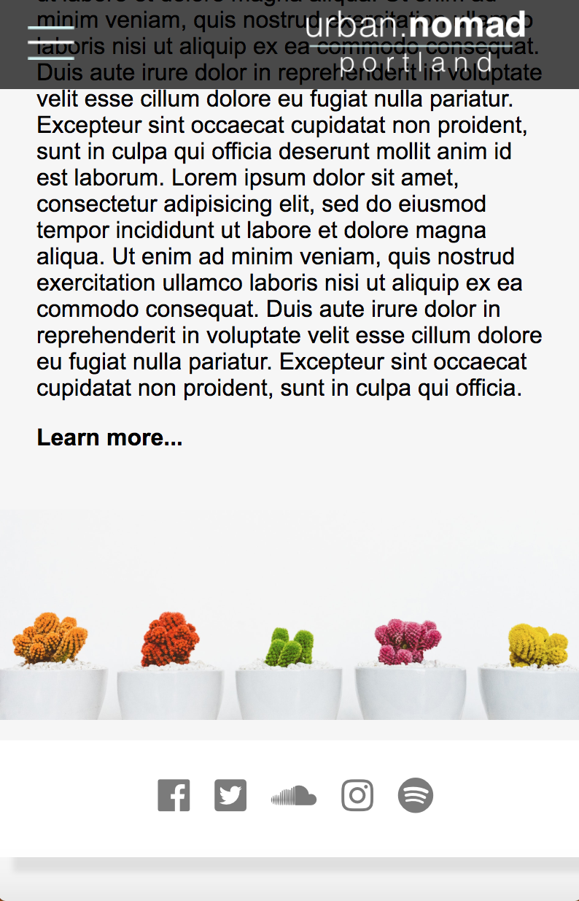
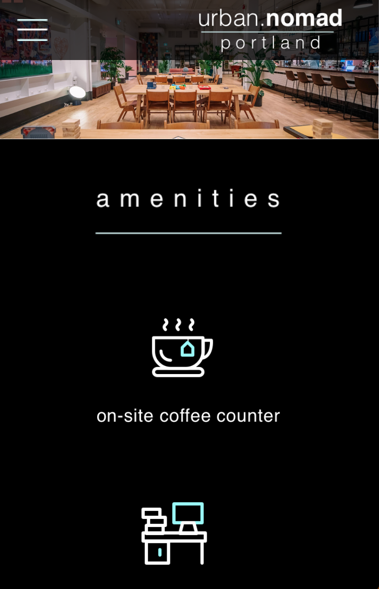
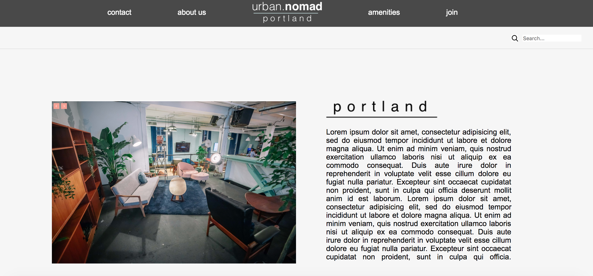
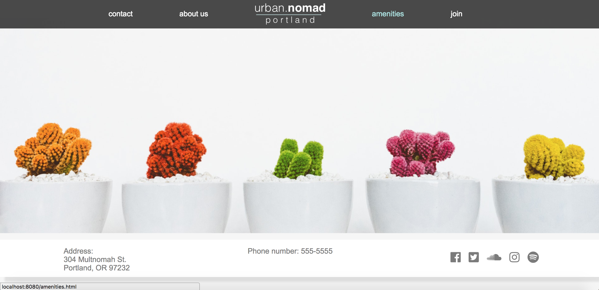
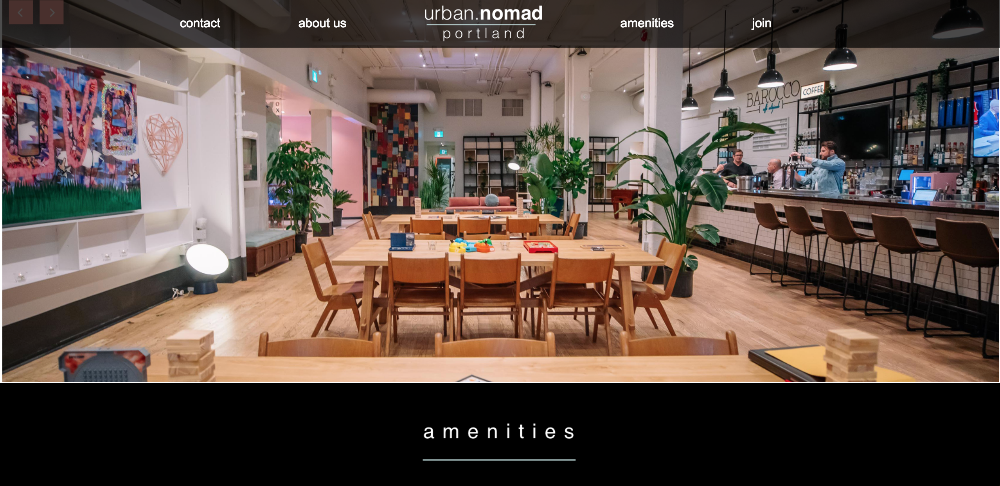

## Urban Nomad

#### Krystal Foster
#### Sep. 21, 2018

### Description

This website is designed for a new company hoping to attract clients and organizations interested in renting a shared workspace. Their website should differentiate itself from standard coworking environments in that it has spunk, special amenities, interior design that reflects their personality as a company, and an understanding and appreciation for both technical and creative work. My vision for this website is to show a place that is both productive and kind, a space removed from the office florescence, elegant but not elitist or ultra-corporate.

### User Stories

#### Vlad:

  *  Needs:
      Vlad is a traveling businessman who needs a calm workspace to focus and complete his work without sacrificing the human contact he would normally experience with his native coworkers.

  * Pain Points:
      Isolation, caffein addiction and frequent flyer points have frayed Vlad's nerves. He'd like to find a co-working space especially inclusive to all kinds of workers, but that would also supply his caffein habit.  

  * How I Can Help:
      Show a clear mission statement and demonstrate the company's personality using the right visuals, language and easy-to-use web navigation. This will show Vlad that our offices are both friendly, but not so much that it detracts from our clients need to focus. Also, coffee and crafts if he's feeling froggy.

#### Katlyn:

  * Needs:
      Sociability, communal enrichment (like yoga, craft events, etc.)

  * Pain Points:
      Katy is not head-over-heels in love with her line of work as of now, so it's very important that she is surrounded by positive people and lovely surroundings to compensate for what her work fails to give her.

  * How I Can Help:
      Show her that our space can offer all of the things lacking in her current experience. Community, love (as the neon sign offers), and the occasional recreational distractions on Thursdays that will keep her motivated and engaged socially throughout the week.

#### Local Companies:

  * Needs:
      A warm place to facilitate their employees that keeps them busy but happy, somewhere that differs from the stringent and cold corporate world.

  * Pain Points:
      Apathy among some of their staff and a lack of outside enrichment and certain comforts and amenities.  

  * How I Can Help:
      Demonstrate that our offices come ready-made with all the human touches, interior design and colorful amenities that perhaps their old offices were lacking or did not think to invest in.

### Brainstorming and Inspiration

  Precursory research on why coworking exists and what draws companies to it. I also looked at the big companies who specialize in it, trying to find a place to pivot from and form a new niche.

### Images

Following are some screenshots of my coded work, fashioned off my sketch files.

#### Mobile Version

About Us Section            |  Amenities Section
:-------------------------:|:-------------------------:
 | 

#### Desktop Version

## Roadmap

Apart from improving the design and fine tuning all the details, I would like to add more navigational keys such as arrows, or "return to previous page" prototyping. I would also like to add some testimonials with block-quotes and/or some pictures of the owners and employees to give the site a more human presence. I would also be sure write up a strong mission statement or welcome message. But since this is a mock-up design I didn't supply that content.

## Responsiveness

All coded pages are responsive thanks to css grid and flexbox. All have been built with mobile-first design in mind.  

### Technologies and Resources

* Sketch
* HTML
* CSS / CSS grid
* Flexbox
* Node Package Manager

### Setup Instructions

First, make sure you have node package manager installed. Then:

``$ git clone https://github.com/Eucile/cowork2``

``$ cd cowork2``

``$ atom .``

``$ npm init -y``

``$ npm run start``

### License

Copyright (c) 2018 **_{ Krystal Foster}_**
